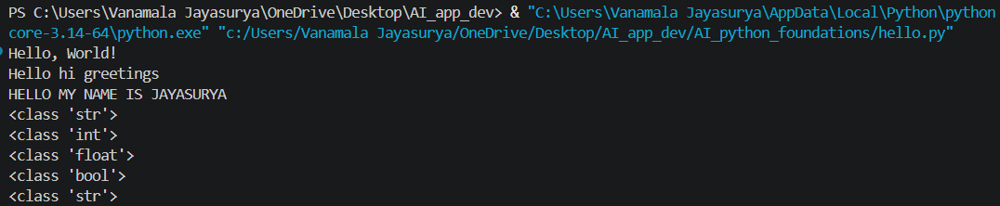
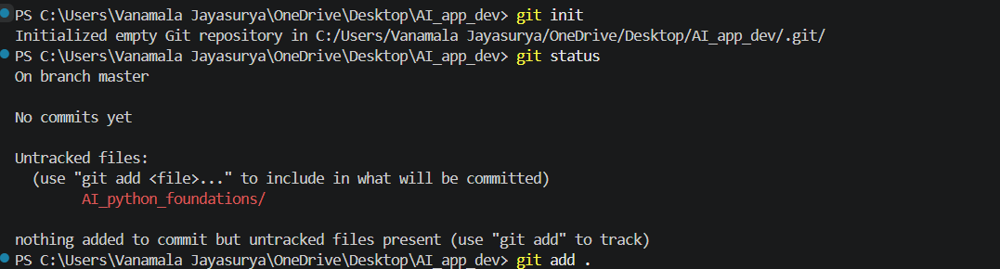
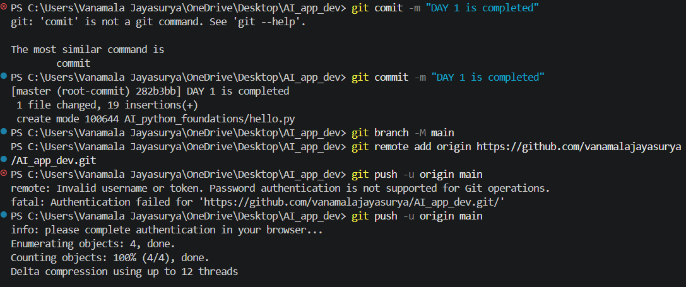
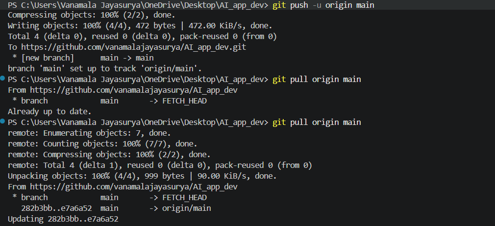
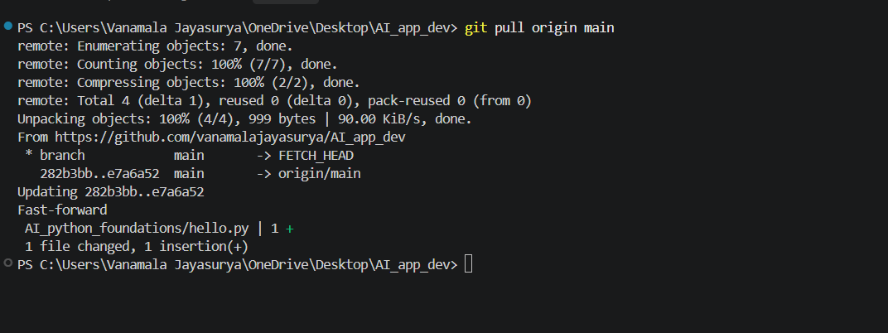

git pull origin main

# Day 1 - Python Fundamentals

This project contains my Day 1 Python practice as part of my AI & Python learning journey.

## Topics Covered

- Printing text using `print()`
- Multiple values in `print()`
- Variables in Python
- Dynamic typing
- Python data types:
  - String
  - Integer
  - Float
  - Boolean

## File

- `AI_python_foundations/hello.py`

## Python Code Example

```python
print("Hello, World!")
print("Hello", "hi", "greetings")
print("HELLO MY NAME IS JAYASURYA")

# Variable declaration
# Dynamic typing
name = "Jayasurya"
print(type(name))

# Integer
age = 22
print(type(age))

# Float
weight = 70.5
print(type(weight))

# Boolean
is_student = True
print(type(is_student))

grade = "A"
print(type(grade))
```

## Expected Output

```
Hello, World!
Hello hi greetings
HELLO MY NAME IS JAYASURYA
<class 'str'>
<class 'int'>
<class 'float'>
<class 'bool'>
<class 'str'>
```

## Author

**Vanamala Jayasurya**

## Day

**Day 1 Completed**

# Day 2 - Python Basics (README.md)

## 📚 Topics Covered

Today I learned the following Python basics:

### 1. List (`[]`)

* A list stores multiple values.
* Lists are **mutable** (values can be changed).

```python
list_of_data_types = [1, 2, 3, "a", 5]

print(type(list_of_data_types))
print(list_of_data_types[3])

list_of_data_types[3] = "monu"
print(list_of_data_types)
```

**Output:**

```
<class 'list'>
a
[1, 2, 3, 'monu', 5]
```

---

### 2. Tuple (`()`)

* A tuple stores multiple values.
* Tuples are **immutable** (values cannot be changed directly).
* To change a value, convert the tuple to a list.

```python
Name = ("Jay", "Surya", "Sai", "Teja")

Name = list(Name)
Name[2] = "Monu"

print(Name)
```

**Output:**

```
['Jay', 'Surya', 'Monu', 'Teja']
```

---

### 3. Dictionary (`{}`)

* A dictionary stores data in **key : value** pairs.
* Dictionaries are mutable.

```python
student = {
    "name": "Jay",
    "age": 22,
    "weight": 70.5,
    "height": 5.9,
    "is_student": True
}

print(student)
print(student["name"])
print(student["age"])
```

**Output:**

```
{'name': 'Jay', 'age': 22, 'weight': 70.5, 'height': 5.9, 'is_student': True}
Jay
22
```

---

### 4. Arithmetic Operations

Python supports basic mathematical operations.

```python
a = 30
b = 50

print(a + b)
print(a - b)
print(a * b)
print(a / b)
print(a % b)
```

**Output:**

```
80
-20
1500
0.6
30
```

---

## ✅ Day 2 Summary

* Learned **List** and how to update values.
* Learned **Tuple** and the concept of **immutable**.
* Learned **Dictionary** and how to access values using keys.
* Practiced **basic arithmetic operators**: `+`, `-`, `*`, `/`, `%`.

**Day 2 completed. 🚀**

# Day 3 - Python Practice (README.md)

## 📚 Topics Covered

Today I practiced **Lists, Tuples, Dictionaries, Arithmetic Operators, Tax Calculator, and Restaurant Bill Calculator** in Python.

---

# 1. List Practice (`practice.py`)

## Code

```python
fruits = ["apple", "banana", "orange", "grape", "kiwi"]

print(fruits)
print(type(fruits))
print(fruits[0])
print(fruits[4])

fruits[2] = "mango"

print(fruits)
```

## Output

```text
['apple', 'banana', 'orange', 'grape', 'kiwi']
<class 'list'>
apple
kiwi
['apple', 'banana', 'mango', 'grape', 'kiwi']
```

## What I Learned

* Lists use `[]`.
* Lists are mutable (values can be changed).
* Index starts from `0`.

---

# 2. Tuple Practice (`practice.py`)

## Code

```python
Names = ("jayasurya", "nikhil", "charan", "teja", "manoj")

print(Names[1])
print(type(Names))

Names = list(Names)
Names[1] = "monu"

print(Names)
print(type(Names))
```

## Output

```text
nikhil
<class 'tuple'>
['jayasurya', 'monu', 'charan', 'teja', 'manoj']
<class 'list'>
```

## What I Learned

* Tuples use `()`.
* Tuples are immutable.
* Convert a tuple to a list using `list()` to modify values.

---

# 3. Dictionary Practice (`practice.py`)

## Code

```python
student = {
    "name": "Jayasurya",
    "age": 22,
    "city": "Hyderabad",
    "is_student": True
}

print(student["name"])
print(student["city"])

student["weight"] = 70.5

print(student)
```

## Output

```text
Jayasurya
Hyderabad
{'name': 'Jayasurya', 'age': 22, 'city': 'Hyderabad', 'is_student': True, 'weight': 70.5}
```

## What I Learned

* Dictionaries use `{}`.
* Data is stored as `key : value`.
* New values can be added using a new key.

---

# 4. Arithmetic Operators (`practice.py`)

## Code

```python
a = 20
b = 6

print(a + b)
print(a - b)
print(a * b)
print(a / b)
print(a % b)
print(a ** b)
print(a // b)
```

## Output

```text
26
14
120
3.3333333333333335
2
64000000
3
```

## What I Learned

| Operator | Meaning        |
| -------- | -------------- |
| `+`      | Addition       |
| `-`      | Subtraction    |
| `*`      | Multiplication |
| `/`      | Division       |
| `%`      | Remainder      |
| `//`     | Floor Division |
| `**`     | Power          |

---

# 5. Tax Calculator (`calculator.py`)

## Code

```python
print("======= calculator.py =======")

itemprice = float(input("Enter the item price: $"))
quantity = int(input("Enter the quantity: "))
tax = float(input("Enter the tax percentage: "))

totalprice = itemprice * quantity
print("Total price before tax:", totalprice)

taxamount = totalprice * (tax / 100)
print("Tax amount:", taxamount)

print("Total price after tax:", totalprice + taxamount)

print("======= calculator.py =======")
```

## Example Output

```text
======= calculator.py =======
Enter the item price: $100
Enter the quantity: 2
Enter the tax percentage: 5

Total price before tax: 200.0
Tax amount: 10.0
Total price after tax: 210.0
======= calculator.py =======
```

## What I Learned

* Used `input()` to get user input.
* Used `float()` and `int()` for type conversion.
* Calculated tax and final amount.

---

# 6. Restaurant Bill Calculator (`Restaurant Bill Calculator.py`)

## Code

```python
print("======= Restaurant Bill Calculator =======")

print("Enter the food price: ₹")
food_price = float(input())

print("Enter the number of items:")
number_of_items = int(input())

print("Enter the GST percentage:")
gst_percentage = float(input())

total_price = food_price * number_of_items

gst_amount = total_price * (gst_percentage / 100)

print("GST Amount: ₹", gst_amount)

print("Total Price: ₹", total_price + gst_amount)
```

## Example Output

```text
======= Restaurant Bill Calculator =======
Enter the food price: ₹250
Enter the number of items: 3
Enter the GST percentage: 5

GST Amount: ₹37.5
Total Price: ₹787.5
```

## What I Learned

* Calculated restaurant bill using GST.
* Used user input and arithmetic operations.
* Printed the final bill amount.

---

# ✅ Day 3 Summary

Today I practiced:

* Lists and updating values.
* Tuples and converting them to lists.
* Dictionaries and adding new key-value pairs.
* Arithmetic operators (`+`, `-`, `*`, `/`, `%`, `//`, `**`).
* Built a Tax Calculator project.
* Built a Restaurant Bill Calculator project.

## 📂 Files Used

* `AI_python_foundations/practice.py`
* `AI_python_foundations/calculator.py`
* `AI_python_foundations/Restaurant Bill Calculator.py`

## 👨‍💻 Author

**Vanamala Jayasurya**

## 🚀 Day 3 Completed


# 🚀 Day 4 – Python Data Structures & Debugging Challenge

## 📚 Topics Covered

* Lists
* Tuples
* Sets
* Dictionaries
* `for` loop
* `if-else`
* `break` statement
* Debugging Python code

---

## 💻 Program 1 – First Non-Repeating Character (Using Dictionary)

### Code

```python
def non_repeating_character(S):
    count = {}

    for ch in S:
        if ch != " ":
            count[ch] = count.get(ch, 0) + 1

    for ch in S:
        if ch != " " and count[ch] == 1:
            return ch

    return "No non-repeating character found"

print("Enter a string:")
S = input()

print("The first non-repeating character is:", non_repeating_character(S))
```

### Output

```text
Enter a string:
programming
The first non-repeating character is: p

Enter a string:
aabbcdd
The first non-repeating character is: c

Enter a string:
aabbcc
The first non-repeating character is: No non-repeating character found
```

---

## 💻 Program 2 – Student Search (Using `range(len(students))`)

### Code

```python
students = ["Ravi", "Anil", "Kiran", "Suresh"]

print("List of students:", students)

for i in range(len(students)):
    if students[i] == "Kiran":
        print("Student found:", students[i])
        break
else:
    print("Student not found")
```

### Output

```text
List of students: ['Ravi', 'Anil', 'Kiran', 'Suresh']
Student found: Kiran
```

---

## 💻 Program 3 – Student Search (Without `range(len(students))`)

### Code

```python
students = ["Ravi", "Anil", "Kiran", "Suresh"]

for student in students:
    if student == "Kiran":
        print("Student found:", student)
        break
else:
    print("Student not found")
```

### Output

```text
Student found: Kiran
```

---

## 🐞 Debugging Challenge

### Original Problem Output

```text
Student not found
Student not found
Student found: Kiran
Student not found
```

### Fixed Output

```text
List of students: ['Ravi', 'Anil', 'Kiran', 'Suresh']
Student found: Kiran
```

---

## 🎯 What I Learned Today

* Difference between List, Tuple, Set, and Dictionary.
* Searching an element in a list.
* Using `break` to stop a loop.
* Importance of indentation in Python.
* Using dictionaries to solve problems efficiently.

---

## 💡 What I Found Difficult

* Understanding the correct placement of `else`.
* Using `break` in loops.
* Solving the bonus challenge without `range(len(students))`.

---

## 📌 Day 4 Summary

* Practiced Python Data Structures.
* Solved the First Non-Repeating Character problem using a dictionary.
* Learned debugging with `for`, `if-else`, and `break`.
* Solved the Student Search problem with and without `range(len(students))`.

**#100DaysOfCode #Python #Day4 #LearningPython #VSCode**

Perfect. Don't replace your old README. Just copy and paste this below your existing Day 4. I kept the same style and format as your current README.

# Day 5 – Conditional Statements & Loops 

## 📚 Topics Covered

Today I learned Conditional Statements, Nested If-Else, and Loops in Python.

## 1. Conditional Operators (`conditional operators.py`)

### Code

Python

Run

```
Number = int(input("Enter the number: "))

if Number < 0:
    print("Number is Negative")
elif Number == 0:
    print("Number is Zero")
elif Number == 999:
    print("Number is Special")
else:
    print("Number is Positive")
```

### What I Learned

* Used `if`, `elif`, and `else`.

* Checked different conditions.

* Learned how Python executes conditions from top to bottom.

## 2. Nested If-Else (`nestedifelse.py`)

### Code

Python

Run

```
num = int(input("Enter the number: "))

if num < 0:
    print("Correct is number")
elif num > 0:
    if num <= 10:
        print("Number between 1–10")
    elif num <= 20:
        print("Number between 11–20")
    else:
        print("Number is greater than 20")
else:
    print("Number is Zero")
```

### What I Learned

* Learned nested `if` statements.

* Checked number ranges using multiple conditions.

* Understood decision making inside another condition.

## 3. Loops (`loops.py`)

### Code

Python

Run

```
for k in range(1, 10):
    print(k + 20)
```

### What I Learned

* Used `for` loops.

* Learned `range(start, stop)`.

* Repeated code using loops.

## ✅ Day 5 Summary

Today I practiced:

* Conditional statements (`if`, `elif`, `else`).

* Nested `if-else`.

* `for` loops with `range()`.

* Number checking and range checking programs.

### 📂 Files Used

* `AI_python_foundations/conditional operators.py`

* `AI_python_foundations/nestedifelse.py`

* `AI_python_foundations/loops.py`

Day 5 Completed. 🚀

# Day 6 – Object-Oriented Programming (README.md)

## 📚 Topics Covered

Today I started learning Object-Oriented Programming (OOP) in Python.

## 1. Class (`oopsconcept.py`)

### Code

Python

Run

```
class Student:
    name = "Jayasurya"

print("Hello, my name is", Student.name)
```

### What I Learned

* A class is a blueprint for creating objects.

* Stored data inside a class.

## 2. Object (`object.py`)

### Code

Python

Run

```
class Car:
    brand = "Volkswagen"

car1 = Car()

print(car1.brand)
```

### What I Learned

* Created an object from a class.

* Accessed class attributes using an object.

## 3. Encapsulation (`Encapsulation.py`)

### Code

Python

Run

```
class Bank:
    def __init__(self, balance):
        self.__balance__ = "2000"

    def show_balance(self):
        print("Balance:", self.__balance__)
```

### What I Learned

* Learned encapsulation.

* Used private variables.

* Updated balance using methods.

## 4. Bank Account Practice (`bank.py`)

### What I Learned

* Created a bank account class.

* Used constructor (`__init__`).

* Practiced deposit and balance methods.

## ✅ Day 6 Summary

Today I practiced:

* Classes and Objects.

* Constructor (`__init__`).

* Methods inside classes.

* Encapsulation.

* Bank Account example.

### 📂 Files Used

* `AI_python_foundations/oopsconcept.py`

* `AI_python_foundations/object.py`

* `AI_python_foundations/Encapsulation.py`

* `AI_python_foundations/bank.py`

Day 6 Completed. 🚀

# Day 7 – Warehouse Management System (README.md)

## 📚 Topics Covered

Today I built my first mini Python project using Functions, Dictionary, and JSON File Handling.

## 📦 Warehouse Management System (`Warehouse Management System.py`)

### Features

* Add Product

* View Products

* Search Product

* Save Products into `warehouse.json`

* Load Existing Products from `warehouse.json`

### Concepts Used

* Functions

* Dictionary

* User Input

* JSON File Handling

* File Read & Write

### What I Learned

* Stored product information in a dictionary.

* Saved data permanently using JSON.

* Loaded previous data from a JSON file.

* Built a simple inventory management project.

## ✅ Day 7 Summary

Today I practiced:

* Functions in Python.

* Dictionary operations.

* JSON file handling (`json.dump()` and `json.load()`).

* Building a CRUD-style mini project.

### 📂 Files Used

* `AI_python_foundations/Warehouse Management System.py`

* `AI_python_foundations/warehouse.json`

Day 7 Completed. 🚀


🌦️ Day 8 – Python API Projects (README.md)
📚 Topics Covered

Today I learned how to use APIs in Python using the requests library. I built three real-world mini projects that fetch live data from the internet.

Weather App (OpenWeather API)

Movie Finder App (OMDb API)

News Headlines App (NewsAPI)

1. Weather App (weather.py)
📌 Project

A Python application that fetches live weather information using the OpenWeather API. It asks the user for a city name and displays weather details.

Code
import requests

API_KEY = "YOUR_API_KEY"

print("🌦️ Weather App")
print("-" * 30)

city = input("Enter city name: ")

url = f"https://api.openweathermap.org/data/2.5/weather?q={city}&appid={API_KEY}&units=metric"

response = requests.get(url)
data = response.json()

if response.status_code == 200:
    city_name = data["name"]
    country = data["sys"]["country"]
    temp = data["main"]["temp"]
    humidity = data["main"]["humidity"]
    condition = data["weather"][0]["main"]
    description = data["weather"][0]["description"]
    wind = data["wind"]["speed"]

    print("\n📍 Weather Report")
    print(f"City        : {city_name}, {country}")
    print(f"🌡️ Temperature : {temp}°C")
    print(f"☁️ Condition   : {condition}")
    print(f"📝 Description : {description}")
    print(f"💧 Humidity    : {humidity}%")
    print(f"💨 Wind Speed  : {wind} m/s")

else:
    print("❌ Error:", data["message"])
Example Output
🌦️ Weather App
------------------------------
Enter city name: Hyderabad

📍 Weather Report
City        : Hyderabad, IN
🌡️ Temperature : 30°C
☁️ Condition   : Clouds
📝 Description : scattered clouds
💧 Humidity    : 68%
💨 Wind Speed  : 4.2 m/s
What I Learned

Used the requests library.

Connected Python with an API.

Read JSON data.

Used if-else for API error handling.

2. Movie Finder App (Movie Finder.py)
📌 Project

A Python application that finds movie details using the OMDb API.

Code
import requests

api_key = "YOUR_API_KEY"

movie_name = input("Enter Movie Name: ")

url = f"http://www.omdbapi.com/?apikey={api_key}&t={movie_name}"

response = requests.get(url)
data = response.json()

if data["Response"] == "True":
    print("\n🎬 Movie Details")
    print("Title :", data["Title"])
    print("Year  :", data["Year"])
    print("Rating:", data["imdbRating"])
else:
    print("❌ Movie Not Found.")
Example Output
Enter Movie Name: Pushpa

🎬 Movie Details
Title : Pushpa
Year  : 2021
Rating: 7.6
What I Learned

Used API keys in Python.

Retrieved movie information from an API.

Displayed data using dictionary keys.

3. News Headlines App (News Headlines App.py)
📌 Project

A Python application that fetches the latest news headlines using NewsAPI.

Code
import requests

api_key = "YOUR_API_KEY"

news_topic = input("Enter News Topic: ")

url = f"https://newsapi.org/v2/everything?q={news_topic}&apiKey={api_key}"

response = requests.get(url)
data = response.json()

if data["status"] == "ok":
    print(f"\n📰 Top News for {news_topic}\n")

    for news in data["articles"][:5]:
        print("•", news["title"])
else:
    print("No news found.")
Example Output
Enter News Topic: AI

📰 Top News for AI

• OpenAI announces new AI model.
• AI is transforming education.
• New robotics breakthrough.
• AI tools help developers.
• Future of Artificial Intelligence.
What I Learned

Fetched live news using NewsAPI.

Used for loops to print multiple headlines.

Accessed list and dictionary data from JSON.

🧠 Concepts Practiced

Concept

	

Used In


requests Library

	

Weather, Movie, News Apps


API Keys

	

All three projects


JSON (.json())

	

Reading API responses


input()

	

User enters city, movie, or topic


if-else

	

Error handling


for Loop

	

Displaying news headlines

✅ Day 8 Summary

Today I practiced:

Working with REST APIs in Python.

Using the requests library.

Reading JSON data from APIs.

Building three API-based Python applications:

🌦️ Weather App

🎬 Movie Finder App

📰 News Headlines App

📂 Files Used

AI_python_foundations/weather.py

AI_python_foundations/Movie Finder.py

AI_python_foundations/News Headlines App.py

👨‍💻 Author

Vanamala Jayasurya

Day 8 Completed. 🚀

This matches the format of your existing README (Day 1–Day 4), so you can paste it directly underneath Day 4 in GitHub.


